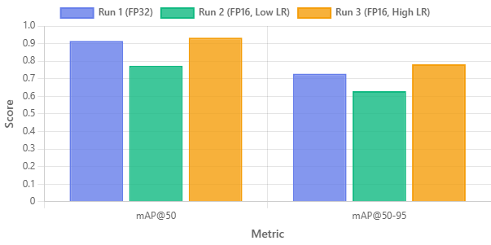
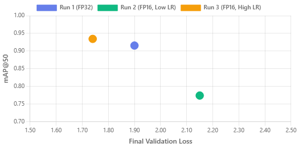
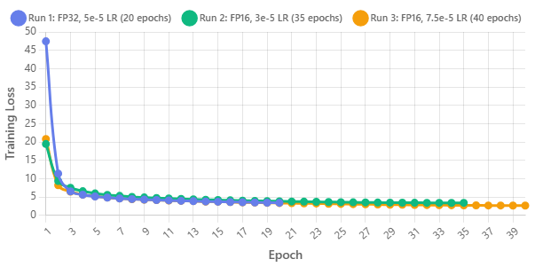
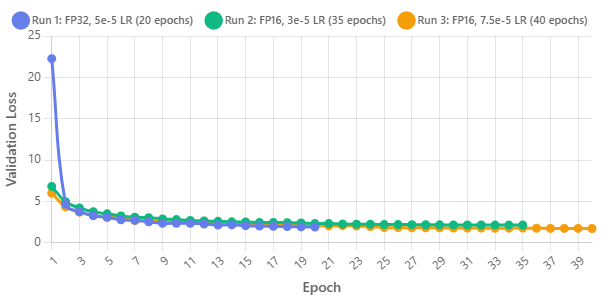

RT-DETR Fine-Tuning & TensorRT Inference
==================================================

Bu klasörde `rt_detr_finetuning_LAST.ipynb` defterinde gerçekleştirilen RT-DETR tabanlı nesne tespiti fine-tune süreci ve sonrasında TensorRT hızlandırmalı çıkarım (inference) adımları özetlenmiştir.

Özet Akış
---------
1. Kurulum: `transformers` (güncel), `accelerate`, `supervision`, `roboflow`, `albumentations`, `torchmetrics` paketleri kuruluyor.
2. Veri Seti: Roboflow API ile YOLOv5 formatında veri (train/valid) indiriliyor.
3. Dataset Hazırlama: `supervision.DetectionDataset` -> özel `SimpleDataset` sınıfı ile HuggingFace `processor` kullanılarak COCO benzeri format dönüşümü.
4. Model: `PekingU/rtdetr_r18vd` checkpoint’i farklı TrainingArguments denemeleri (v1, v2, v3) ile fine-tune edildi. En iyi model `EarlyStopping` (patience=4) ve `load_best_model_at_end=True` ile seçiliyor.
5. Değerlendirme: mAP@50 ve mAP@50-95 `supervision.metrics.MeanAveragePrecision` ile hesaplanıyor; ayrıca örnek görselleştirme ve IoU matris çıktıları üretiliyor.
6. Kaydetme: En iyi checkpoint ve `processor` saklanıp arşivleniyor (zip). 
7. TensorRT: `torch_tensorrt.compile` ile önce FP16 (başarısız olursa FP32) engine derleniyor, `.ts` (exported program) kaydı yapılıyor.
8. Video İnference & FPS: Video üzerinde ısınma (warmup), zamanlama, anlık / ortalama FPS, kutu çizimi ve çıktı video kaydı.

Kullanım İpuçları
-----------------
- Ortam değişkenlerini (API anahtarları) doğrudan koda yazmak yerine PowerShell’de:  
	`$Env:ROBOFLOW_API_KEY = "YOUR_KEY"`  
	`$Env:WANDB_API_KEY    = "YOUR_KEY"`
- Eğitim: Defterdeki ilgili hücreleri sırasıyla çalıştırın; VRAM yetersizse `per_device_train_batch_size` düşürüp `gradient_accumulation_steps` artırın.
- TensorRT derlemesi için: `pip install torch-tensorrt` (PyTorch ve CUDA sürüm uyumuna dikkat edin).
- Inference giriş boyutunu (1920x1080 -> 1088 pad) değiştirmek isterseniz TensorRT engine’i yeniden derlemeniz gerekir.

Örnek Adımlar
----------------------------
```
pip install -U transformers accelerate supervision roboflow torchmetrics albumentations torch-tensorrt
python -c "from roboflow import Roboflow; import os; rf=Roboflow(api_key=os.getenv('ROBOFLOW_API_KEY'))"
```

Görsel Sonuçlar
---------------
Eğitim & validasyon sürecine dair bazı karşılaştırma grafik ve dağılımlar:






3 adet eğitim gerçekleştirilmiştir. En iyi sonuçlar 3.eğitimde alınmıştır. Detaylı sonuçlar için html'e bakabilirsiniz.

Notlar
------
- API anahtarlarını repoya commitlemeyin.
- Performans ölçümlerinde FPS yalnızca model ileri geçiş süresini (post-process dahil) temsil edecek şekilde ayarlanmıştır; I/O yükü farklı olabilir.
- FP16 başarısız olursa otomatik FP32 fallback uygulanır.

Lisans / Kaynaklar
------------------
- Model tabanı: RT-DETR (PekingU)
- Kütüphaneler: HuggingFace Transformers, Supervision, Torch-TensorRT, Roboflow

Kısa özet bu kadar. Detaylar için defteri inceleyin (`rt_detr_finetuning_LAST.ipynb`).
